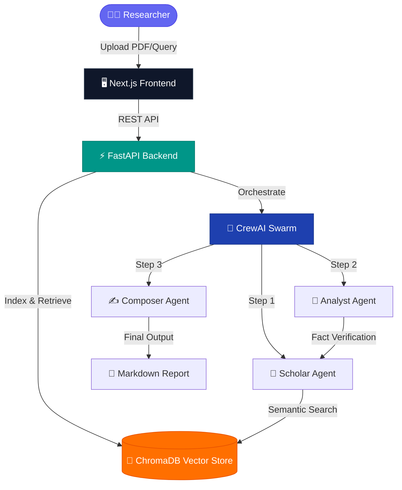

<p align="center">
  
</p>

<h1 align="center">📚 Lexicon AI</h1>
<h3 align="center">Agentic Research Workspace — Multi-Agent AI for Literature Intelligence</h3>

<p align="center">
  <a href="https://nextjs.org/"></a>
  <a href="https://fastapi.tiangolo.com/"></a>
  <a href="https://github.com/joaomdmoura/crewai"></a>
  <a href="https://www.trychroma.com/"></a>
</p>

<p align="center">
  <a href="https://github.com/kalyan-1845/lexicon/stargazers"></a>
  <a href="https://github.com/kalyan-1845/lexicon/network/members"></a>
  <a href="https://github.com/kalyan-1845/lexicon/issues"></a>
  <a href="https://github.com/kalyan-1845/lexicon/blob/main/LICENSE"></a>
  <a href="https://github.com/kalyan-1845/lexicon/pulls"></a>
  
</p>

<p align="center">
  A high-performance, privacy-first AI workspace designed for literature research,<br/>multi-agent orchestration, and localized retrieval-augmented generation (RAG).
</p>

<p align="center">
  🔗 <a href="https://lexicon-sooty.vercel.app/"><strong>Live Demo</strong></a> •
  📖 <a href="https://github.com/kalyan-1845/lexicon/wiki"><strong>Documentation</strong></a> •
  🐛 <a href="https://github.com/kalyan-1845/lexicon/issues/new?template=bug_report.yml"><strong>Report Bug</strong></a> •
  💡 <a href="https://github.com/kalyan-1845/lexicon/issues/new?template=feature_request.yml"><strong>Request Feature</strong></a>
</p>

---

## 📑 Table of Contents

- [✨ Features](#-features)
- [🏗️ Architecture](#️-architecture)
- [🛠️ Tech Stack](#️-tech-stack)
- [🚀 Quick Start](#-quick-start)
- [🐳 Docker Setup](#-docker-setup)
- [📁 Project Structure](#-project-structure)
- [🤝 Contributing](#-contributing)
- [🗺️ Roadmap](#️-roadmap)
- [👥 Contributors](#-contributors)
- [⭐ Star History](#-star-history)
- [📜 License](#-license)
- [🙏 Acknowledgments](#-acknowledgments)

---

## ✨ Features

🧠 **Multi-Agent Intelligence** — Three specialized AI agents (Scholar, Analyst, Composer) collaborate to research, validate, and synthesize insights from your documents.

📄 **Smart Document Ingestion** — Upload PDFs and research papers. Automatic parsing, chunking, and semantic indexing for instant retrieval.

🔍 **Semantic Search & RAG** — Context-aware retrieval-augmented generation powered by ChromaDB vector embeddings.

🔒 **Privacy-First Design** — Seamless integration with Ollama for fully local inference. Your data never leaves your machine.

📡 **Real-Time Agent Telemetry** — Server-Sent Events (SSE) stream internal reasoning logs, showing you exactly how agents think step-by-step.

🗂️ **Workspace Isolation** — Isolated vector namespaces and context memory pools per active research project.

📝 **Markdown Insights Editor** — AI-generated research reports output directly as editable markdown documents.

🔗 **Automated Citation Engine** — Academic-grade citations with cross-reference mapping and fact verification.

💬 **Intelligent Chat Interface** — Command palette, keyboard shortcuts, and a premium conversational UI.

🌙 **Dark Mode & Theming** — Beautiful, responsive interface with dynamic theme switching.

---

## 🏗️ Architecture

Lexicon implements a highly decoupled **Multi-Agent Orchestration** design pattern:



| Agent | Role | Responsibility |
|-------|------|----------------|
| 📖 **The Scholar** | Research & Ingestion | Parses uploaded documents, performs semantic search, indexes scientific literature |
| 🔬 **The Analyst** | Validation & Critique | Validates factual consistency, resolves contradictions, maps citation networks |
| ✍️ **The Composer** | Synthesis & Output | Formulates final markdown insight documents with academic rigor |

---

## 🛠️ Tech Stack

| Layer | Technology | Purpose |
|-------|-----------|---------|
| **Frontend** | Next.js 14, TypeScript, TailwindCSS | Responsive UI with App Router |
| **Backend** | FastAPI (Python 3.10+) | Async REST API with SSE streaming |
| **Vector Store** | ChromaDB | Semantic embeddings & retrieval |
| **AI Orchestration** | CrewAI + LangChain | Multi-agent workflow management |
| **Local LLM** | Ollama | Privacy-first local inference |
| **Database** | PostgreSQL + pgvector | Persistent storage with vector support |
| **Deployment** | Vercel + Docker | Cloud & containerized deployment |

---

## 🚀 Quick Start

### Prerequisites

- **Node.js** >= 18.x
- **Python** >= 3.10
- **Git**
- **Ollama** (optional, for local inference)

### 1️⃣ Clone the Repository

```bash
git clone https://github.com/kalyan-1845/lexicon.git
cd lexicon
```

### 2️⃣ Set Up Environment Variables

```bash
cp .env.example .env
# Edit .env with your API keys
```

### 3️⃣ Start the Frontend

```bash
cd frontend
npm install
npm run dev
```

> Frontend runs at `http://localhost:3000`

### 4️⃣ Start the Backend

```bash
cd backend
pip install -r requirements.txt
uvicorn app.main:app --reload
```

> Backend runs at `http://localhost:8000`

---

## 🐳 Docker Setup

Spin up the entire stack with one command:

```bash
docker-compose up --build
```

This launches:
- **Frontend** → `localhost:3000`
- **Backend API** → `localhost:8000`
- **PostgreSQL + pgvector** → `localhost:5432`
- **Ollama** → `localhost:11434`

---

## 📁 Project Structure

```
lexicon/
├── frontend/                  # Next.js 14 Frontend
│   ├── src/
│   │   ├── app/               # App Router pages
│   │   │   ├── page.tsx       # Landing page
│   │   │   ├── dashboard/     # Dashboard view
│   │   │   └── workspace/     # Research workspace
│   │   ├── components/        # 18 React components
│   │   │   ├── ChatArea.tsx   # Main chat interface
│   │   │   ├── Sidebar.tsx    # Navigation sidebar
│   │   │   ├── PDFUploader.tsx
│   │   │   ├── AgentWorkflow.tsx
│   │   │   └── ...
│   │   └── utils/             # API client & utilities
│   └── package.json
│
├── backend/                   # FastAPI Backend
│   └── app/
│       ├── main.py            # Application entrypoint
│       ├── api/               # REST endpoints
│       │   ├── chat.py        # Chat & query API
│       │   ├── upload.py      # Document upload API
│       │   └── citations.py   # Citation management
│       ├── core/              # Database & config
│       ├── models/            # Data models
│       └── services/          # Business logic
│           ├── agents.py      # CrewAI agent definitions
│           ├── llm_factory.py # LLM provider abstraction
│           └── memory.py      # Persistent memory
│
├── .github/                   # GitHub configuration
│   ├── workflows/             # CI/CD pipelines
│   ├── ISSUE_TEMPLATE/        # Issue templates
│   └── PULL_REQUEST_TEMPLATE.md
│
├── docker-compose.yml         # Full-stack Docker setup
├── CONTRIBUTING.md            # Contribution guidelines
├── CODE_OF_CONDUCT.md         # Community standards
├── SECURITY.md                # Security policy
├── CHANGELOG.md               # Version history
├── roadmap.md                 # Development roadmap
└── LICENSE                    # MIT License
```

---

## 🤝 Contributing

We love contributions! Lexicon AI is part of **NSoC'26** (Nexus Spring of Code 2026).

### How to Contribute

1. **Fork** the repository
2. **Create** a feature branch (`git checkout -b feature/amazing-feature`)
3. **Commit** your changes (`git commit -m 'Add amazing feature'`)
4. **Push** to the branch (`git push origin feature/amazing-feature`)
5. **Open** a Pull Request

### NSoC'26 Contributors

Check our [open issues](https://github.com/kalyan-1845/lexicon/issues) for NSoC-labeled tasks with difficulty levels:

| Level | Points | Difficulty |
|-------|--------|------------|
| 🟢 Level 1 | 3 pts | Beginner — UI tweaks, docs, small fixes |
| 🟡 Level 2 | 5 pts | Intermediate — API, logic, features |
| 🔴 Level 3 | 10 pts | Advanced — Architecture, AI, performance |

> 📖 Read our [Contributing Guide](CONTRIBUTING.md) for detailed instructions.

---

## 🗺️ Roadmap

| Phase | Status | Highlights |
|-------|--------|------------|
| Phase 1: Foundation | ✅ Complete | Core RAG engine, PDF upload |
| Phase 2: Professional UI | ✅ Complete | Premium design, workspace isolation |
| Phase 3: Intelligence | ✅ Complete | Multi-agent logic, plugin ecosystem |
| Phase 4: Enterprise | ✅ Complete | Mobile responsive, data export |
| Phase 5: Production | ✅ Complete | Database, security hardening |
| Phase 6-9: Advanced AI | ✅ Complete | Chain-of-thought, citations, streaming |
| Phase 10: Dynamic Intelligence | ✅ Complete | Brand identity, unified async engine |
| Phase 11: Collaborative Ecosystem | 🚧 In Progress | Real-time collaboration features |

> 📖 See the full [Roadmap](roadmap.md) for details.

---

## 👥 Contributors

Thanks to all the amazing people who have contributed to Lexicon AI! 🎉

<a href="https://github.com/kalyan-1845/lexicon/graphs/contributors">
  
</a>

---

## ⭐ Star History

If you find Lexicon AI useful, please consider giving it a star! ⭐

<a href="https://star-history.com/#kalyan-1845/lexicon&Date">
 <picture>
   <source media="(prefers-color-scheme: dark)" srcset="https://api.star-history.com/svg?repos=kalyan-1845/lexicon&type=Date&theme=dark" />
   <source media="(prefers-color-scheme: light)" srcset="https://api.star-history.com/svg?repos=kalyan-1845/lexicon&type=Date" />
   
 </picture>
</a>

---

## 📜 License

This project is licensed under the **MIT License** — see the [LICENSE](LICENSE) file for details.

---

## 🙏 Acknowledgments

- [NSoC'26](https://nsoc.nitsri.ac.in/) — Nexus Spring of Code, NIT Srinagar
- [CrewAI](https://github.com/joaomdmoura/crewai) — Multi-agent orchestration framework
- [LangChain](https://github.com/langchain-ai/langchain) — LLM application framework
- [ChromaDB](https://www.trychroma.com/) — Open-source embedding database
- [Ollama](https://ollama.ai/) — Local LLM inference
- [Vercel](https://vercel.com/) — Deployment platform

---

<p align="center">
  Made with ❤️ by <a href="https://github.com/kalyan-1845">Kalyan Reddy</a>
</p>

<p align="center">
  <a href="#-lexicon-ai">⬆ Back to Top</a>
</p>
