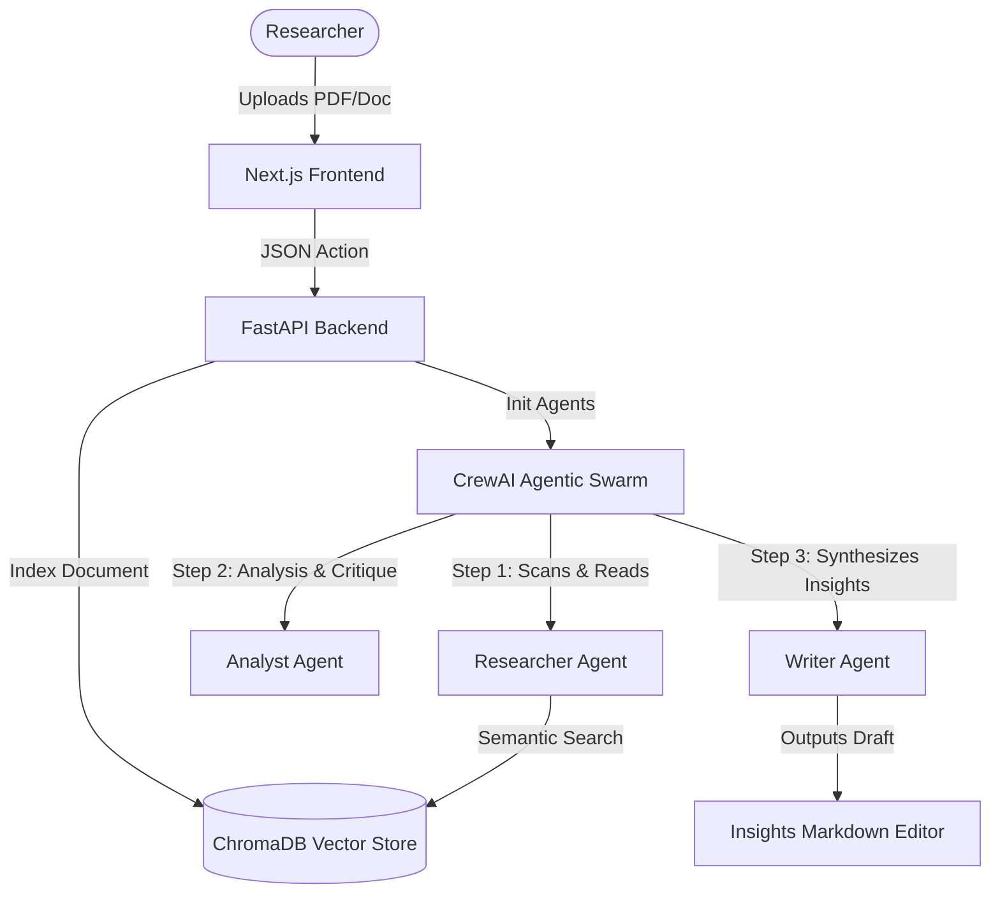

# 📚 Lexicon AI — Agentic Research Workspace

[](https://nextjs.org/)
[](https://fastapi.tiangolo.com/)
[](https://github.com/joaomdmoura/crewai)
[](https://www.trychroma.com/)

A high-performance, minimalist, privacy-first AI workspace designed for deep literature research, multi-agent orchestration, and localized retrieval-augmented generation (RAG).



## 🏗 System Architecture (Agentic Workflow)
Lexicon implements a highly decoupled **Multi-Agent Orchestration** design pattern:
1. **The Scholar**: Ingests, parses, and Indexes uploaded scientific documents and online web telemetry.
2. **The Analyst**: Validates factual consistency, resolves contradictory literature, and maps citations.
3. **The Composer**: Formulates final markdown insight documents, outputting them straight to the client.

## ⚡ Key Highlights
- **True Workspace Separation**: isolated vector namespaces and context memory pools per active project.
- **Agentic Telemetry Stream**: Real-time server-sent events (SSE) trace internal reasoning logs and step-by-step logic loops.
- **Localized Embeddings & Inference**: Seamless connection to Ollama for zero-leak local processing.

## 🛠 Technology Stack
- **Frontend Core**: Next.js 14, TypeScript, TailwindCSS
- **Server API**: FastAPI (Asynchronous Python 3.10+)
- **Semantic Store**: ChromaDB Vector Database
- **Swarm Orchestration**: CrewAI & LangChain modules

## 🚀 Quick Setup
1. **Frontend Server**:
   ```bash
   cd frontend && npm install && npm run dev
   ```
2. **Backend Engine**:
   ```bash
   cd backend && pip install -r requirements.txt && uvicorn app.main:app --reload
   ```

## 📜 License
MIT License. Developed by Kalyan Reddy for autonomous research environments.
